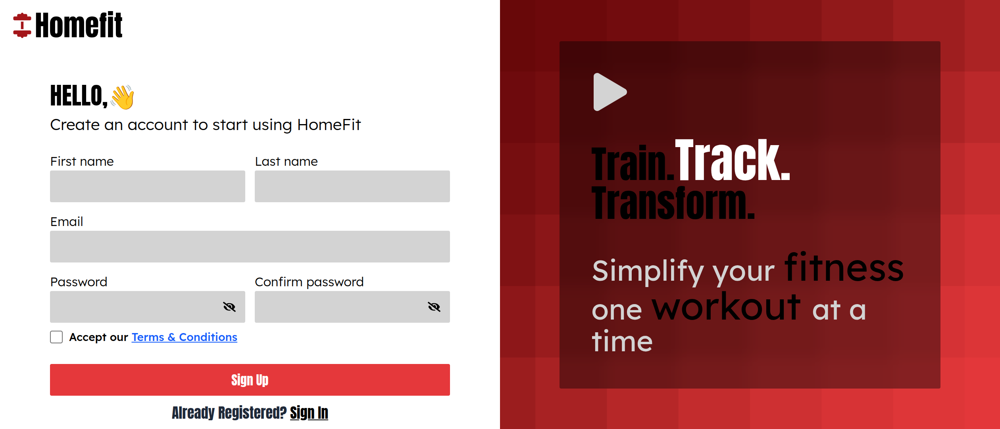

# HomeFit

HomeFit is a personal workout tracker built to help users stay consistent with their fitness goals. It allows users to browse a curated set of workouts, log their training sessions, track performance, and manage their personal data in a dashboard.

## Features

* Workout Database – Explore categorized workouts by difficulty and type

* YouTube Demos – Each workout includes an embedded demo video

* Workout Logs – Log reps, sets, and notes per session

* Settings Panel – Update profile data, export logs, or delete your account

* Authentication – User sign up/login with Passport Local and sessions

* Verification – Email PIN verification for new users

* Forgot Password – Secure password reset workflow

## Screenshots

## Tech Stack

Frontend: React, Tailwind CSS, React Router

State Management: Redux Toolkit Query

Backend: Node.js, Express, MySQL

Authentication: Passport.js with local strategy, express-session

Other: YouTube Data API v3, date-fns, custom hooks